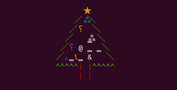

# clj-xmas



## Usage

```clj
clojure -Sdeps '{:deps {liquidz/clj-xmas {:git/url "https://github.com/liquidz/clj-xmas" :sha "ddae8092c079656a62fafd9655e00c4cf8496a07"}}}' -m xmas.core
```

### Options

 * Tree size: `-s`, `--size`
   * Default: `5`
   * `clojure -Sdeps '...' -m xmas.core -s 20`
 * How many trees: `-n`, `--number`
   * Default: `1`
   * `clojure -Sdeps '...' -m xmas.core -n 5`
 * Animation: `-a`, `--animation`
   * Default: `false`
   * `clojure -Sdeps '...' -m xmas.core -a`
 * Animation interval: `-i`, `--interval`
   * Default: `1`
   * `clojure -Sdeps '...' -m xmas.core -a -i 2`

## Native image

 * graalvm is required.
 * `$GRAALVM_HOME` must be defined.
 * `make` to build native image.
